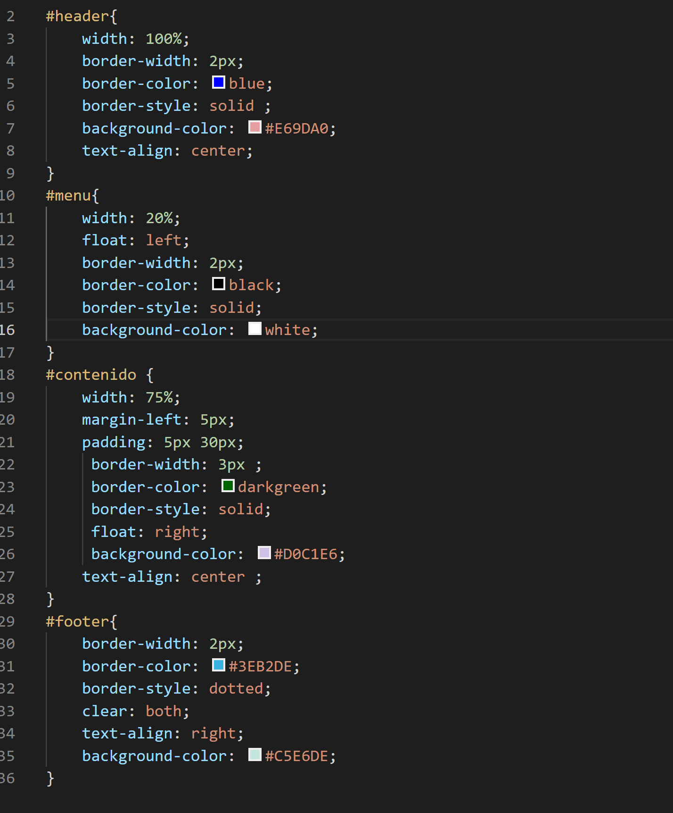
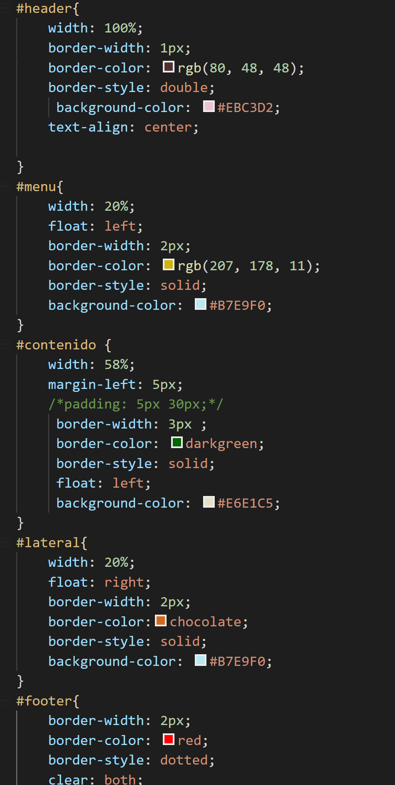
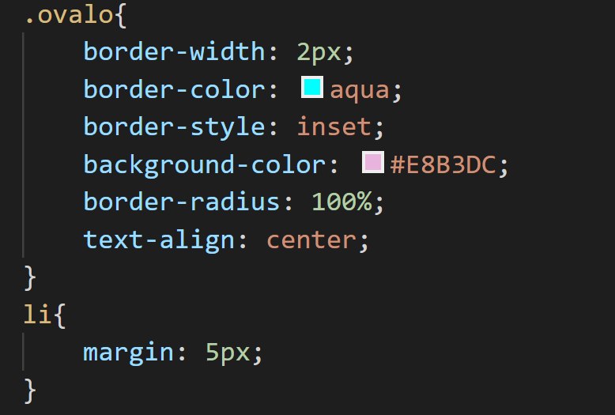
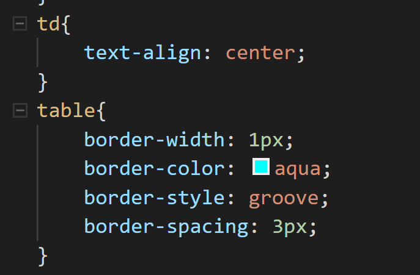
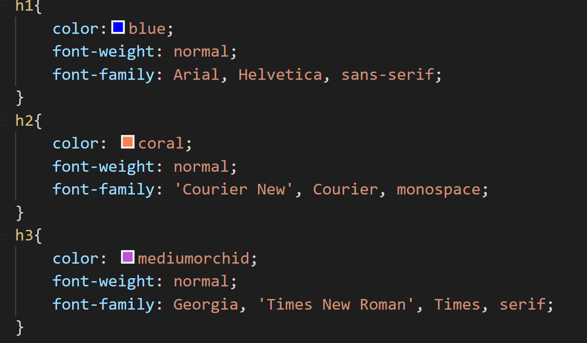

# Practica02-Mi-Sitio-Web-CSS-
Pagina web con estilos en CSS 
Utilizacion de selectores por ID para la fácil identificación de las características que tendrá la pagina 

Este diseño lo utilizamos para poder generar una pagina con 2 columnas de información, en el identificador header están las características correspondientes para el diseño dela cabecera de la pagina 
El identificador contenido es utilizado para las características de lo que en este caso seria todo lo que este dentro de la etiqueta div, y el footer utilizado para darle estilo al pie de pagina 

En este caso utilizamos adicionalmente un etiqueta  mas que seria la lateral en esta daríamos estilo a un menú de navegación adicional que se ubicara en la parte derecha de la pagina web 

Para darle un estilo de ovalo al menu de navegación de forma de un ovalo, utilizamos una clase que lo llamamos ovalo  para identificarlo con facilidad, la etiqueta li para darle un margen de 5 pixeles a cada ítem 
Para darle forma a nuestra table por defecto utilizamos la regla table en la cual podemos modificar las características d ellos bordes, como el tamaño de las líneas el espacio entre cada uno de los cuadros y color del borde del mismo. Con la regla td alineamos el texto que esta dentro del cuadro 

Estilos  a las etiquetaas de títulos h1, h2, h3 en la cual podemos cambiar de colores al teto que representara cada una de ellas y también modificar la fuente y que sea diferente para cada uno de los textos 

